# Machine Learning Engineer Nanodegree
## Capstone Project


## I. Definition

### Project Overview
Starbucks Corporation is an American coffee company and coffeehouse chain. Starbucks was founded in Seattle, Washington, in 1971. As of early 2019, the company operates over 30,000 locations worldwide.

Once every few days, Starbucks sends out an offer to users of the mobile app. An offer can be merely an advertisement for a drink or an actual offer such as a discount or BOGO (buy one get one free). Some users might not receive any offer during certain weeks.

Not all users receive the same offer, and that is the challenge to solve with this data set.

Every offer has a validity period before the offer expires. As an example, a BOGO offer might be valid for only 5 days. You'll see in the data set that informational offers have a validity period even though these ads are merely providing information about a product; for example, if an informational offer has 7 days of validity, you can assume the customer is feeling the influence of the offer for 7 days after receiving the advertisement.

If the company sends more offers or irrelevant offers to a person then there is no use. That's why they should send only relevant offers to a person who is likely going to use this offer which benefits the company. We need to predict who are more likely going to use a certain offer and send that offer only to them to make company beneficial.


### Problem Statement
Building a model that predicts whether or not someone will respond to an offer based on given demographics and offer type. Thus there will be two possible outputs from the model, making it Binary Classification:

1. A person will respond to an offer (1)
2. A person will not respond to an offer(0)

#### Steps:

1. **Feature Engineering :** Removing the redundant features, Analysing the relation between features.
2. **Preprocessing :** One-hot-encoding the data, handling "null" values, dimensionality reduction.
3. **Splitting the data :** Splitting the data into training and test dataset.
4. **Model :** Building a Deep Learning Model with PyTorch.
5. **Training :** Training the model with train dataset.
6. **Testing :** Testing the previously trained model with test data.
7. **Tuning :** Tuning the hyperparameters of the model to get better results.


### Metrics
The metrics that I have used here is **F1-score** since the data has unbalanced class distribution.

```F1-score = 2 * (precision * recall) / (precision + recall)```


## II. Analysis

### Data Exploration
The data is contained in three files:

1. portfolio.json - containing offer ids and meta data about each offer (duration, type, etc.)
2. profile.json - demographic data for each customer
3. transcript.json - records for transactions, offers received, offers viewed, and offers completed

Here is the schema and explanation of each variable in the files:

**1. portfolio.json**

* id (string) - offer id
* offer_type (string) - type of offer i.e, BOGO, discount, informational
* difficulty (int) - minimum required spend to complete an offer
* reward (int) - reward given for completing an offer
* duration (int) - time for offer to be open, in days
* channels (list of strings)

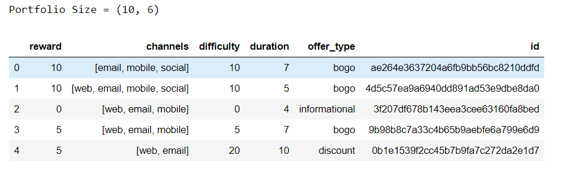

**2. profile.json**

* age (int) - age of the customer
* became_member_on (int) - date when customer created an app account
* gender (str) - gender of the customer (note some entries contain 'O' for other rather than M or F)
* id (str) - customer id
* income (float) - customer's income

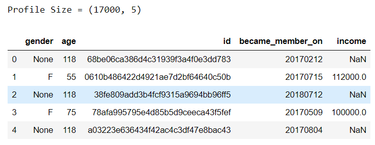


**3. transcript.json**

* event (str) - record description (ie transaction, offer received, offer viewed, etc.)
* person (str) - customer id
* time (int) - time in hours since start of test. The data begins at time t=0
* value - (dict of strings) - either an offer id or transaction amount depending on the record

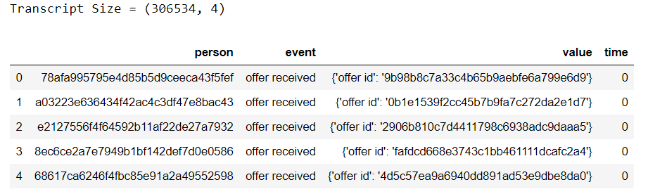


Here we can see some data is in number form and some data is in characters. Since a Machine Learning Model doesn't take input in characters, we need to convert the field which are not numbers to numbers by using **one-hot-encoding** method. Some of the values are high in number, it will be computationally expensive task, so we need to reduce these values such as field **_income_** in **profile.json** using **PCA** method.


### Exploratory Visualization

*  The Histogram is a normal distribution between customer age and count.
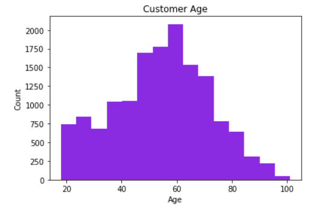

*  The Histogram is a right skewed distribution between customer income and count.
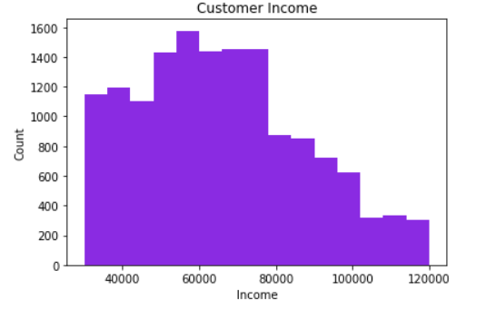

*  The chart shows between customer gender and count.
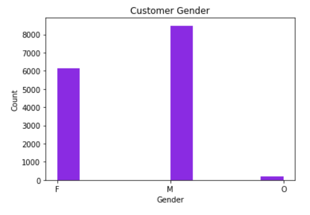

*  The chart shows between popular offer types.
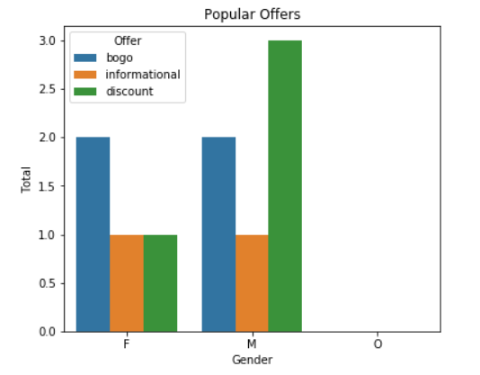


### Algorithms and Techniques
As we are predicting that a person will/not respond to a given offer, this will be binary classification problem. So I am using here are a Binary Classifier and a Neural Network as Neural Network can be used for almost any task.

#### Neural Network Model :

Neural networks are simple models of the way the nervous system operates. The basic units are neurons, which are typically organized into layers, as shown in the following figure.

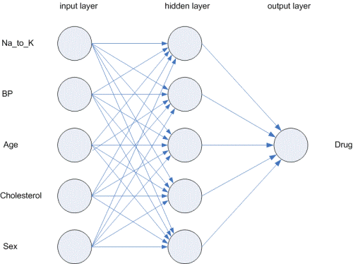

A neural network is a simplified model of the way the human brain processes information. It works by simulating a large number of interconnected processing units that resemble abstract versions of neurons.

The processing units are arranged in layers. There are typically three parts in a neural network: an input layer, with units representing the input fields; one or more hidden layers; and an output layer, with a unit or units representing the target field(s). The units are connected with varying connection strengths (or weights). Input data are presented to the first layer, and values are propagated from each neuron to every neuron in the next layer. Eventually, a result is delivered from the output layer.

The network learns by examining individual records, generating a prediction for each record, and making adjustments to the weights whenever it makes an incorrect prediction. This process is repeated many times, and the network continues to improve its predictions until one or more of the stopping criteria have been met.

Initially, all weights are random, and the answers that come out of the net are probably nonsensical. The network learns through training. Examples for which the output is known are repeatedly presented to the network, and the answers it gives are compared to the known outcomes. Information from this comparison is passed back through the network, gradually changing the weights. As training progresses, the network becomes increasingly accurate in replicating the known outcomes. Once trained, the network can be applied to future cases where the outcome is unknown.


After I use both of the algorithms, I have used **F1-score** metric to choose the best model out of the benchmark models.

### Benchmark
As the benchmark models I have used KNeighborsClassifier and GaussianNB to compare aganist a Neural Network model using the metric **F1-score**.

## III. Methodology

### Data Preprocessing

* **portfolio.json**

  1. One-hot-encoding to be done to the categorial fields - "offer_type", "channels"

* **profile.json**

  1. Some of the rows in "gender" and "income" are Nan. we have dropped those rows.
  2. "became_member_on" field has the date and need to be separated as "year" and "month" columns.
  
* **transcript.json**

  1. One-hot-encoding to be done to the categorial fields - "offer_type", "channels".
  2. One-hot-encoding to be done to the categorial fields - "event".
  3. In "value" field inside json object there are 2 keys i.e., "offer id" and "offer_id". These key names have been changed to              "offer_id".
  4. Fill with '0' in "amount" and "reward".
  
* Merging "transcript" and "profile" with field "person" and "id" = transcript_profile
* Merging "transcript_profile" and "portfolio" with field "offer_id" = transcript_profile_portfolio

### Implementation

Neural Network Model has been used to train the data here. **PyTorch**

* **Model** :
  1. Linear Layer = 24 -> 10
  2. Dropout = 0.3
  3. Linear Layer = 10 -> 1
  4. Sigmoid()

* **Optimizer** = SGD
* **Criterion** = BCELoss
* **Learning Rate** = 0.001
* **Momentum** = 0.5
* **Epochs** = 10

### Refinement

I have used Adam optimizer initially but the model didn't perform well. It was giving me usual outputs other than 0 to 1 even though I have used Sigmoid activation function. Later I changed it to SDG and it performed well.


## IV. Results

### Model Evaluation and Validation

I have tested the model with 30% of the data which has not been used for training the model and got 0.93 f1-score.

### Justification

As the model has 0.93 f1-score, if the model has been given the demographics of a person and an offer type it will give the correct output of whether a person will respond to an offer or not.

## V. Conclusion

### Free-Form Visualization

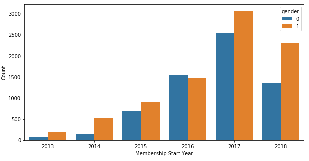

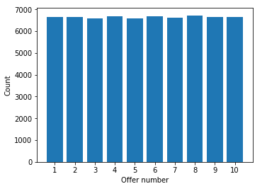

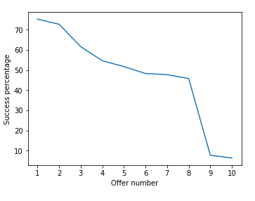

### Reflection

**Summary :**
1) Analyzing the given three data files and performing preprocessing steps required to form the data.
2) Splitting the data into training and test dataset.
2) Constructing the Machine Learning Model.
3) Training the model with the training data.
4) Testing the previously trained model with test data.

The difficult part me was to reconstruct the given data into a meaningful data which can be used to train the model.

### Improvement

The one aspect that can be improved is we can be able to predict the time in which a user will respond to a particular offer.


